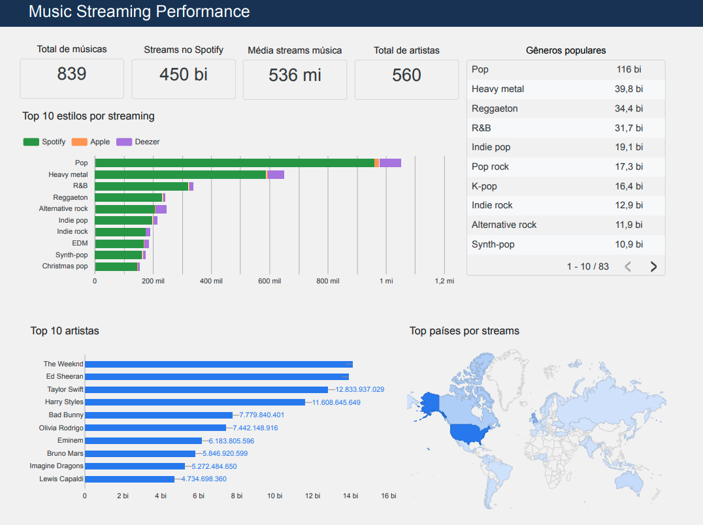

# Laboratória - Análise de Streaming


## 📌 Sobre o Projeto

Projeto desenvolvido durante o curso da Laboratória com foco em análise de dados musicais de plataformas de streaming.

O objetivo é investigar padrões de popularidade musical, identificar características associadas ao alto desempenho de faixas e construir visualizações analíticas para suporte à tomada de decisão.


## 🗂️ Fontes de Dados

Os dados utilizados no projeto foram disponibilizados pela Laboratória e incluem informações de:

- Spotify
- Competições musicais
- Popularidade de faixas
- Métricas de streaming

## ⚙️ Pipeline do Projeto

```text
Raw CSV Files
      ↓
Data Cleaning (SQL)
      ↓
Data Profiling
      ↓
Tabela Analítica Final
      ↓
Dashboard Looker Studio
```

## Dashboard Online
[Acessar Dashboard](https://datastudio.google.com/reporting/d59f11b1-1d5e-42c6-8381-94e592002e0e)




## 🛠️ Tecnologias


## 👩🏻‍💻 Autora

[](https://www.linkedin.com/in/pathilink/)

## 🔓 Licença

[](https://opensource.org/licenses/MIT)
